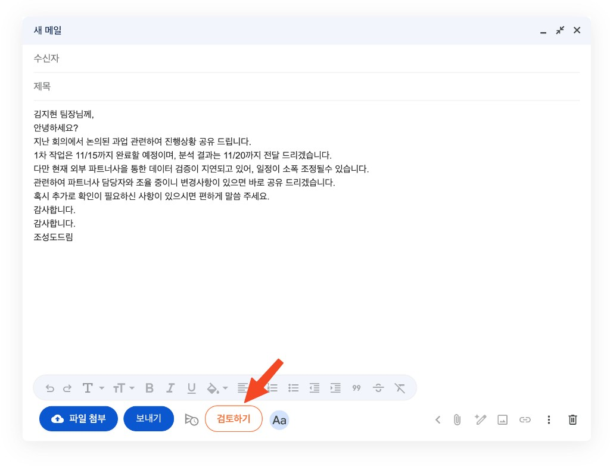
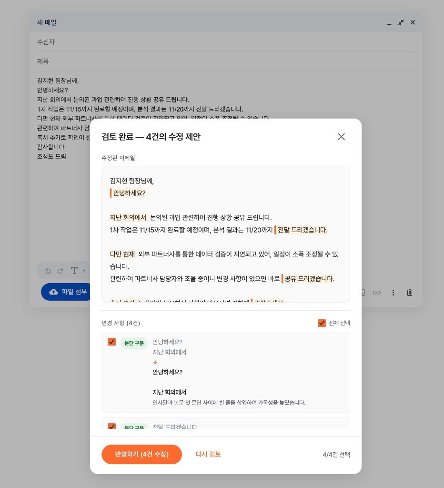

# 보내기 전에 (BeforeSend)

Gmail 발송 전 한국어 비즈니스 이메일의 오류를 잡아내고 수정하는 크롬 확장 프로그램

| 검토하기 버튼 | 수정 제안 |
|:---:|:---:|
|  |  |

## 만든 배경

저는 국내 유일의 비즈니스 이메일 단독 저서인 《[일잘러를 위한 이메일 가이드 101](https://www.aladin.co.kr/shop/wproduct.aspx?ItemId=147995514&srsltid=AfmBOoqRySNkM9BJXxkzAfbZFz-nd59llXa49US7FZ-_IY7llsDScfrB)》의 저자입니다.

Gmail에는 이미 Gemini 기반 '글쓰기 도우미'가 있지만, 내 문체로 써주는 것이 아니라 어색한 결과물이 나올 때가 많습니다. 이메일은 작성자의 말투와 톤이 그대로 신뢰도로 이어지기 때문에, AI가 대신 써주는 것보다 **내가 쓴 문장을 유지하면서 오류만 잡아주는 도구**가 더 실용적이라고 생각했습니다.

'보내기 전에'는 문체를 바꾸지 않습니다. 띄어쓰기, 맞춤법, 호칭, 조사 같은 신뢰성과 가독성에 직결되는 부분만 제한적으로 교정합니다.

## 주요 기능

- Gmail 작성 창에 **[검토하기]** 버튼 추가
- 7개 카테고리 오류 감지: 수신자 호칭, 중복 표현, 띄어쓰기, 오타/맞춤법, 경어체 불일치, 조사 오류, 문단 구분
- Google Gemini API를 활용한 실시간 스트리밍 검토
- 수정된 전체 이메일을 모달로 미리보기
- 변경 사항별 체크박스로 선택적 반영
- 작성자 문체 유지 (LLM이 작성한 티가 나지 않도록)
- 답장/전달 시 수신자 정보 및 원본 메일 컨텍스트 자동 추출
- 검토 카테고리 ON/OFF, 사용자 규칙 추가, LLM 모델 직접 입력

---

## 설치 방법

> **3단계만 따라하면 바로 사용할 수 있습니다.**

### 1단계. 파일 다운로드

1. 이 페이지 상단의 초록색 **Code** 버튼을 클릭한 뒤, **Download ZIP**을 선택합니다.
2. 다운로드된 `BeforeSend-main.zip` 파일을 원하는 위치에 압축 해제합니다.

### 2단계. Chrome에 확장기능 등록

1. Chrome 주소창에 `chrome://extensions` 를 입력하고 이동합니다.
2. 우측 상단의 **개발자 모드** 토글을 켭니다.
3. **압축해제된 확장 프로그램을 로드합니다** 버튼을 클릭합니다.
4. 압축 해제한 `BeforeSend-main` 폴더를 선택합니다.
5. 확장기능 목록에 **보내기 전에**가 나타나면 등록 완료입니다.

### 3단계. API 키 설정

이 확장기능은 Google Gemini API를 사용합니다. **사용자 본인의 API 키**가 필요합니다.

1. [Google AI Studio](https://aistudio.google.com/apikey)에 접속하여 API 키를 발급받습니다.
2. Chrome 툴바에서 **보내기 전에** 아이콘을 클릭하여 설정 페이지를 엽니다.
3. API 키 입력란에 발급받은 키를 붙여넣습니다.
4. **[연결 테스트]** 버튼을 클릭하여 정상 연결을 확인합니다.
5. **[저장]** 버튼을 클릭합니다.

---

## 사용 방법

1. Gmail에서 이메일을 작성합니다.
2. 보내기 버튼 옆의 **[검토하기]** 버튼을 클릭합니다.
3. 모달 창에서 수정된 전체 이메일과 변경 사항 목록을 확인합니다.
4. 각 변경 사항의 체크박스를 해제하면 해당 수정을 제외할 수 있습니다.
5. **[반영하기]** 를 클릭하면 선택한 수정 사항이 작성 창에 적용됩니다.
6. Gmail의 **[보내기]** 버튼으로 발송합니다.

## 설정

설정 페이지에서 다음 항목을 변경할 수 있습니다.

| 항목 | 설명 |
|------|------|
| LLM 모델 | 기본값 `gemini-3.1-flash-lite-preview`. 다른 Gemini 모델명을 직접 입력 가능 |
| 검토 카테고리 | 7개 카테고리 개별 ON/OFF |
| 사용자 규칙 | 추가 검토 규칙을 자유롭게 입력 (예: '프로젝트' 대신 '과업'으로 수정) |

## 개인정보 처리

- 이메일 본문은 **[검토하기]** 클릭 시에만 Google Gemini API로 전송됩니다.
- 전송은 사용자 본인의 API 키로 이루어지며, 개발자는 이메일 내용에 접근하지 않습니다.
- 자체 서버를 운영하지 않으며, Gemini API 외에 어떤 외부 서비스에도 데이터를 전송하지 않습니다.
- API 키와 설정은 브라우저 내부(`chrome.storage`)에만 저장됩니다.
- 이메일 본문은 검토 후 어디에도 저장되지 않습니다.
- 확장기능을 삭제하면 모든 로컬 데이터가 자동 삭제됩니다.

<details>
<summary>프로젝트 구조</summary>

```
BeforeSend/
├── manifest.json          # Chrome 확장기능 설정
├── background.js          # Service Worker (Gemini API 호출, 스토리지)
├── content.js             # Gmail DOM 감지, 버튼 주입, 검토 흐름
├── selectors.js           # Gmail DOM 셀렉터
├── prompts.js             # 오류 카테고리 정의, LLM 프롬프트
├── email-extractor.js     # 이메일 본문/컨텍스트 추출
├── text-replacer.js       # 작성 창 텍스트 교체
├── review-panel.js        # 모달 리뷰 패널 UI (Shadow DOM)
├── review-panel.css       # 리뷰 패널 스타일
├── options.html / .js / .css  # 설정 페이지
├── privacy.html           # 개인정보처리방침
└── icons/                 # 확장기능 아이콘 (16, 48, 128px)
```

</details>

<details>
<summary>기술 스택</summary>

- Chrome Extension Manifest V3
- Google Gemini API (SSE 스트리밍)
- Shadow DOM (Gmail CSS 격리)
- MutationObserver + 폴링 (Gmail SPA 대응)
- WeakMap (다중 작성 창 상태 관리)

</details>

## 제작

조성도 ([pengdo@myorange.io](mailto:pengdo@myorange.io))

## 라이선스

[MIT](LICENSE)
